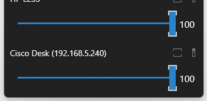
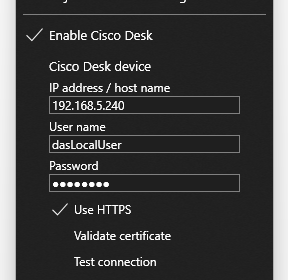

# Monitorian + Cisco Desk

Monitorian is a Windows desktop tool to adjust the brightness of multiple monitors with ease.

## About this Cisco Desk fork

*This repository is a fork of the popular [emoacht/Monitorian](https://github.com/emoacht/Monitorian) that adds the ability to adjust the screen backlight of a Cisco RoomOS Desk device (e.g. Desk Pro) right alongside regular monitors. **In short, I got tired of having an easy way to adjust all my display brightness with the exception of my Cisco Desk Pro, which does not support HDMI DDC\CI - but it does have RoomOS xAPI, and supporting that endpoint over xAPI is what this fork is all about, and nothing else.** See the [Cisco Desk device section](#cisco-desk-device) for details.*

*Differences from upstream:*

 - *A Cisco RoomOS Desk device can be configured from the tray menu and shown as an additional brightness slider (disabled by default).*
 - *The Microsoft Store version and its subscription add-on features (hot keys, command-line get/set, commands) do not apply to this fork; some related code and documentation have subsequently been trimmed. This fork will not be distributed through the Microsoft Store, and will not support the bonus subscription features the fork parent's author makes available.*

---
 

The user can change the brightness of monitors, including external ones, either individually or in unison. For the system with an ambient light sensor, the adjusted brightness can be shown along with configured one.

 
(DPI: 100%)

In addition, the user can change the adjustable range of brightness and contrast for each monitor seamlessly.

&nbsp;
 

Additional languages:

 - Arabic (ar) by [@MohammadShughri](https://github.com/mohammadshughri)
 - Catalan (ca) by [@ericmp33](https://github.com/ericmp33)
 - German (de) by [@uDEV2019](https://github.com/uDEV2019)
 - Greek (el-GR) by [@NickMihal](https://github.com/NickMihal)
 - Spanish (es) by [@josemirm](https://github.com/josemirm) and [@ericmp33](https://github.com/ericmp33)
 - Persian (fa-IR) by [@sinadalvand](https://github.com/sinadalvand)
 - French (fr) by [@AlexZeGamer](https://github.com/AlexZeGamer) and [@Rikiiiiiii](https://github.com/rikiiiiiii)
 - Italian (it) by [@GhostyJade](https://github.com/GhostyJade)
 - Japanese (ja-JP) by [@emoacht](https://github.com/emoacht)
 - Korean (ko-KR) by [@VenusGirl](https://github.com/VenusGirl)
 - Dutch (nl-NL) by [@JordyEGNL](https://github.com/JordyEGNL)
 - Polish (pl-PL) by [@Daxxxis](https://github.com/Daxxxis) and [@FakeMichau](https://github.com/FakeMichau)
 - Portuguese (pt-BR) by [@guilhermgonzaga](https://github.com/guilhermgonzaga)
 - Romanian (ro) by [@calini](https://github.com/calini)
 - Russian (ru-RU) by [@SigmaTel71](https://github.com/SigmaTel71) and [@San4es](https://github.com/San4es)
 - Albanian (sq) by @RDN000
 - Swedish (sv-SE) by [@Sopor](https://github.com/Sopor)
 - Turkish (tr-TR) by [@webbudesign](https://github.com/webbudesign)
 - Ukrainian (uk-UA) by [@kaplun07](https://github.com/kaplun07)
 - Vietnamese (vi-VN) by [@dongsinhho](https://github.com/dongsinhho)
 - Simplified Chinese (zh-Hans) by [@ComMouse](https://github.com/ComMouse), [@zhujunsan](https://github.com/zhujunsan), [@XMuli](https://github.com/XMuli), [@FISHandCHEAP](https://github.com/Fishandcheap) and [@FrzMtrsprt](https://github.com/FrzMtrsprt)
 - Traditional Chinese (zh-Hant) by [@toto6038](https://github.com/toto6038) and [@XMuli](https://github.com/XMuli)

## Requirements

 * Windows 7 or newer
 * .NET Framework __4.8__
 * An external monitor must be DDC/CI enabled.

## Install/Uninstall

This fork is built from source (see [Setup](#setup)). The original Monitorian can be obtained from the [upstream repository](https://github.com/emoacht/Monitorian).

When you place the executable files on your own, please note the following:

 - The settings file (and other file) will be created at: `[system drive]\Users\[user name]\AppData\Local\Monitorian\`
 - When you check [Start on sign in], a registry value will be added to: `HKEY_CURRENT_USER\Software\Microsoft\Windows\CurrentVersion\Run`

## Remarks

 - The monitor name shown in main window can be changed to distinguish monitors easily. To change the name, press and hold it until it turns to be editable.
 - To adjust the brightness by a touchpad, place two fingers on it and swipe horizontally. The touchpad must be a precision touchpad.
 - The number of monitors shown at a time is up to 4.
 - In case an external monitor is not shown, read [detection of external monitors](#detection-of-external-monitors).
 - This app identifies each monitor by an unique identifier given by the OS. Even with the same PC and monitor, this identifier may vary depending on the type of connection (e.g. USB-C DisplayPort Alt mode) or the selection of connectors of the same type. Consequently, if a monitor is reconnected to the different connector, it may not be regarded as the same monitor and some functions may not work as expected.

## Detection of external monitors

This app checks if each external monitor is controllable through DDC/CI and shows only controllable ones. 

For this purpose, this app requests a monitor to send its capabilities information through DDC/CI and checks if it includes the capabilities to get/set the brightness. If capabilities information is not received or these capabilities are not included, such monitor will be regarded as not controllable through DDC/CI.

This function has been tested and worked well in most cases. Therefore, if a monitor is not shown, it is most likely caused by hardware-oriented reasons that cannot be solved by this app. Such reasons include:

1. The monitor model does not support DDC/CI.

1. The monitor's DDC/CI setting is OFF. You may need to change the setting by OSD menu.

1. The monitor's DDC/CI function is weird. Some monitors are found not to return correct capabilities information.

1. The PC's connector does not support DDC/CI.

1. The cable, converter, or docking station which connects the PC and the monitor is not compatible with DDC/CI. Thunderbolt/USB-C cables are generally compatible but converters aren't. Surface Dock and Surface Dock 2 are known to be compatible. 

1. The monitor or the PC have issues including contact failure in connector. This is particularly the case for old monitors.

If you think it is worth to report, read [reporting](#reporting) and then create an issue with logs and other relevant information.

## Cisco Desk device

This fork can show a brightness slider for a Cisco RoomOS Desk device and adjust its screen backlight over the network, individually or in unison with other monitors. It has been tested with a Cisco Desk Mini, Desk, Desk Pro and Desk Pro G2. Note that Desk Pro G2 requires RoomOS 26.7 or higher due to a blocking defect that existed in prior versions. 

 

To configure it, right-click the tray icon to open the menu:

 1. Check `Enable Cisco Desk`.
 2. Under `Cisco Desk device`, enter the IP address / host name of the device as well as the user name and password of a device account.
 3. Tap `Test connection`. On success, the current backlight value is shown and the slider for the device appears in main window shortly after.

 

Under the hood, the backlight is set with `xCommand Video Output Monitor Backlight Set` and read with `xStatus Video Output Monitor Backlight` through the device's HTTP(S) xAPI using Basic authentication.

Remarks:

 - HTTP(S) API access must be enabled on the device (`xConfiguration NetworkServices HTTP Mode`) and the account must have ADMIN or INTEGRATOR role.
 - HTTPS is used by default. Certificate validation is off by default because these devices commonly present a self-signed certificate. If your device has a proper certificate, turn on `Validate certificate`.
 - The password is stored encrypted (Windows DPAPI, current user scope) in the settings file.
 - Showing the slider requires reading the current backlight, which in turn requires a RoomOS version that reports `xStatus Video Output Monitor Backlight` (e.g. RoomOS 26.7 on Desk Pro G2). If the value cannot be read, the slider stays hidden until the device responds to a rescan.
 - While the slider is moved, values are sent to the device asynchronously and intermediate values may be skipped; the latest value always wins.
 - If the brightness is changed from the device directly, Monitorian does not see this shift and will continue to reflect the prior brightness level (may fix with future enhancement).
 - Support is only included for a single associated Cisco Desk series device.

## Development

To begin with, please read [contributing guidelines](https://github.com/emoacht/Monitorian/blob/master/docs/CONTRIBUTING.md).

This app is a WPF app developed and tested with Surface Pro series (upstream author). The "Cisco Desk" fork has been tested on an AMD workstation with NVIDIA gfx, as well as an HP laptop with Lunar Lake CPU\iGPU.

### Reporting

The controllability of an external monitor depends on whether the monitor successfully responds to DDC/CI commands. Even if a monitor is expected to be DDC/CI compatible, it may fail to respond typically when the system starts or resumes.

In any case, reporting on the controllability of a monitor MUST include probe.log and operation.log described below. The logs will be the starting point to look into the issue.

### Probe

 - You can check the compatibility of your monitor by __probe.log__. It will include raw information on monitors, including capabilities through DDC/CI, from various APIs that are used to find accessible monitors. To get this log, tap `Probe into monitors` in the hidden menu described below.
 - To open the hidden menu, <ins>click app title at the top of menu window 3 times.</ins> 

### Rescan

 - As part of testing, you can manually trigger to rescan monitors via `Rescan monitors` in the hidden menu. A system sound will be played when completed.

### Operations

 - As part of testing, you can set this app to record operations to scan monitors and reflect their states. To enable the recording, check `Record operations to log` in the hidden menu. After some information is recorded, you will be able to copy __operation.log__ by `Copy accumulated log`.
 - If you notice an issue, <ins>enable the recording and then wait until the issue happens. When you notice the issue again, copy this log and check the information including the change before and after the issue.</ins>

### Command-line arguments

 - As part of testing, you can store persistent arguments in `Command-line arguments` in the hidden menu. They will be tested along with current arguments when this app starts.
 - For example, if you want this app to always use English language (default), set `/lang en` in this box.

### Exceptions

 - If anything unexpected happens, __exception.log__ will be saved. It will be useful source of information when looking into an issue.

### Setup

1. [Install Visual Studio](https://docs.microsoft.com/en-us/visualstudio/install/install-visual-studio).
2. In Visual Studio Installer, go to **Individual components** tab and make sure the following components are checked and installed.

| Components                                                  | Note                                                                                        |
|-------------------------------------------------------------|---------------------------------------------------------------------------------------------|
| .NET Framework 4.8 SDK .NET Framework 4.8 targeting pack | The version must match TargetFrameworkVersion of project (.csproj) file of each project. |
| Windows 10 or 11 SDK                                        | The version must be equal to or newer than 10.0.19041.0.                                    |

3. In Visual Studio, open Extension Manager and make sure **HeatWave for VS2022** is installed.

4. Load the solution by specifying `/Source/Monitorian.sln`. Then go to the solution explorer and right click the solution name and execute `Restore NuGet Packages`.

### Globalization

An alternative language can be shown by adding a Resources (.resx) file into `/Source/Monitorian.Core/Properties` folder. Each Resources file stores name/value pairs for a specific language and will be selected automatically depending on the user's environment.

 - The file name must be in `Resources.[language-culture].resx` format.
 - The name of a name/value pair must correspond to that in the default `Resources.resx` file to override it.

### Reference

 - VESA [Monitor Control Command Set (MCCS)](https://www.google.co.jp/search?q=VESA+Monitor+Control+Command+Set+Standard+MCCS) standard

## History

Ver 4.15.0.1 - Cisco Desk

 - Fork upstream 4.15 parent
 - Add new model and UI for Cisco Desk series
 - Modify core to call the new model 

Ver 4.15 

- unknown improvements, see commits

Ver 4.14 2026-3-22

 - Fix window placement
 - Add Persian (fa-IR) language. Thanks to @sinadalvand!

Ver 4.13 2025-8-4

 - Enable to adjust SDR content brightness

Ver 4.11 2025-6-11

 - Enable to invert scroll direction

Ver 4.10 2024-12-26

 - Improve internal code
 - Add Vietnamese (vi-VN) language. Thanks to @dongsinhho!

Ver 4.9 2024-11-16

 - Improve internal code
 - Add Swedish (sv-SE) language. Thanks to @Sopor!

Ver 4.8 2024-10-15

 - Fix bug

Ver 4.7 2024-7-21

 - Improve internal code
 - Add Albanian (sq) language. Thanks to @RDN000Add!

Ver 4.6 2023-12-8

 - Modify app icon
 - Add Greek (el-GR) language. Thanks to @NickMihal!

Ver 4.5 2023-9-29

 - Modify behaviors and so on

Ver 4.4 2023-6-20

 - Fix bugs and so on

Ver 4.3 2023-4-21

 - Fix window position on Windows 11 Build 22621

Ver 4.2 2023-3-21

 - Change function to change in unison
 - Supplement French (fr) language. Thanks to @Rikiiiiiii!
 
Ver 4.1 2023-3-13

 - Improve internal code
 - Supplement Ukrainian (uk-UA) language. Thanks to @kaplun07!
 - Supplement Russian (ru-RU) language. Thanks to @San4es!

Ver 4.0 2022-12-31

 - Modify UI
 - Add Ukrainian (uk-UA) language. Thanks to @kaplun07!

Ver 3.15 2022-12-4

 - Fix touchpad swipe
 - Supplement Simplified Chinese (zh-Hans) language. Thanks to @FrzMtrsprt!

Ver 3.14 2022-10-23

 - Make change of monitors arrangement reflected immediately

Ver 3.13 2022-8-29

 - Shorten scan time when multiple external monitors exist
 - Supplement German (de) language. Thanks to @uDEV2019!
 
Ver 3.12 2022-7-4

 - Enable mouse horizontal wheel to change brightness concurrently (except that in unison)

Ver 3.11 2022-6-2

 - Enable to use accent color for brightness
 - Supplement Korean (ko-KR) language. Thanks to @VenusGirl!
 - Fix error message for unreachable monitor

Ver 3.10 2022-4-12

 - Redesign small slider
 - Add Catalan (ca) language. Thanks to @ericmp33!
 - Supplement Spanish (es) language. Thanks to @ericmp33!
 - Improve Simplified Chinese (zh-Hans) language. Thanks to @FISHandCHEAP!
 - Supplement Traditional Chinese (zh-Hant) language. Thanks to @XMuli!

Ver 3.9 2022-1-20

 - Add Portuguese (pt-BR) language. Thanks to @guilhermgonzaga!
 - Supplement Simplified Chinese (zh-Hans) language. Thanks to @XMuli!
 - Fix Dutch (nl-NL) language. Thanks to @JordyEGNL!

Ver 3.8 2021-12-18

 - Add Romanian (ro) language. Thanks to @calini!

Ver 3.7 2021-12-3

 - Fix issue of combination of moving in unison and deferring change
 - Modify DPI awareness of the icon

Ver 3.6 2021-9-30

 - Fix count for scan process
 - Add Italian (it) language. Thanks to @GhostyJade!

Ver 3.5 2021-9-9

 - Make rounded corners default on Windows 11
 - Add Traditional Chinese (zh-Hant) language. Thanks to @toto6038!

Ver 3.4 2021-8-30

 - Add Dutch (nl-NL) language. Thanks to @JordyEGNL!
 - Supplement Simplified Chinese (zh-Hans) language. Thanks to @zhujunsan!

Ver 3.3 2021-8-20

 - Add Arabic (ar) language. Thanks to @MohammadShughri!

Ver 3.2 2021-8-9

 - Supplement German (de) language. Thanks to @uDEV2019!

Ver 3.1 2021-8-4

 - Supplement Polish (pl-PL) language. Thanks to @FakeMichau!
 - Add Turkish (tr-TR) language. Thanks to @webbudesign!
 - Supplement Russian (ru-RU) language. Thanks to @SigmaTel71!
 - Add Spanish (es) language. Thanks to @josemirm!

Ver 3.0 2021-7-1

 - Change UI

Ver 2.19 2021-6-16

 - Enable to adjust brightness by precision touchpad

Ver 2.18 2021-5-23

 - Add German (de) language. Thanks to @uDEV2019!

Ver 2.17 2021-5-19

 - Add French (fr) language. Thanks to @AlexZeGamer!

Ver 2.16 2021-4-11

 - Add Korean (ko-KR) language. Thanks to @VenusGirl!

Ver 2.14 2021-3-26

 - Improve internal processes

Ver 2.13 2021-2-13

 - Improve internal process

Ver 2.11 2021-1-26

 - Add Russian (ru-RU) language. Thanks to @SigmaTel71!
 - Add Polish (pl-PL) language. Thanks to @Daxxxis!
 - Add Simplified Chinese (zh-Hans) language. Thanks to @ComMouse!

Ver 2.9 2020-12-22

 - Improve codes

Ver 2.8 2020-11-23

 - Adjust mouse wheel roll

Ver 2.7 2020-10-30

 - Enable to change adjustable range
 - Adjust scan process
 - Add get/set brightness test to probe

Ver 2.6 2020-8-10

 - Enable to defer update of brightness

Ver 2.5 2020-8-1

 - Fix issue on empty description

Ver 2.4 2019-12-30

 - Improve scan process

Ver 2.3 2019-11-28

 - Change scan process

Ver 2.2 2019-11-18

 - Change setting to show adjusted brightness by ambient light enabled as default
 - Fix bugs

Ver 2.1 2019-11-6

 - Change location to show when the icon is in overflow area
 - Change behavior when sliders are moving in unison
 - Fix bugs

Ver 2.0 2019-8-6

 - Enable operation by arrow keys
 - Redesign slider

Ver 1.12 2019-3-9

 - Modify to handle raw brightnesses correctly when raw minimum and maximum brightnesses are not standard values. Thanks to @reflecat!
 - Change target framework to .NET Framework 4.7.2

Ver 1.11 2019-2-7

 - Further suppress an exception

Ver 1.10 2019-2-3

 - Change to enable transparency and blur effects only when transparency effects of OS is on

Ver 1.9 2018-12-5

 - Change scan timings after resume

Ver 1.8 2018-11-24

 - Supplement generic monitor name with connection type

Ver 1.7 2018-8-22

 - Improved finding monitor name for Windows 10 April 2018 Update (1803)

Ver 1.6 2018-5-25

 - Extended function to control DDC/CI connected monitor
 - Modified function to enable moving together

Ver 1.5 2018-2-12

 - Improved handling of uncontrollable monitor

Ver 1.4 2018-1-17

 - Modified handling of monitor names

Ver 1.2 2017-10-12

 - Added control by mouse wheel
 - Added function to show adjusted brightness

Ver 1.0 2017-2-22

 - Initial release

## License

 - MIT License

## Libraries

 - [XamlBehaviors for WPF](https://github.com/microsoft/XamlBehaviorsWpf)

## Developer

 - emoacht (emotom[atmark]pobox.com)

## Attribution & Trademarks
The stylized Cisco logo included in this repository is the property of Cisco Systems, Inc. and/or its affiliates. Cisco and the Cisco logo are trademarks or registered trademarks of Cisco Systems, Inc. in the U.S. and other countries.